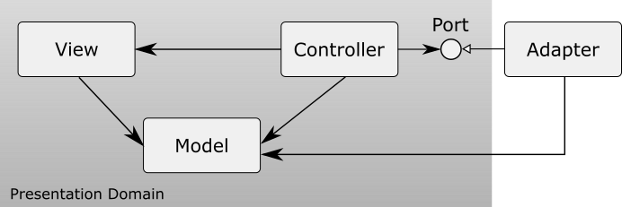

## Overview

Charites is a base class library for a desktop application with Model View Controller architecture.



In Charites, the roles of a model, view, and controller are redefined as follows.

### Model

The model represents an object model in the presentation domain.
It has its properties, its internal states, events that occur when its internal states are changed, that are usually normal .NET events, and so on,
but does not have any business logic.
It is similar to Presentation Model, but unlike to Presentation Model, it does not have main presentaion logic.
It has only behaviors for internal states that is encapsulated.
It has also references to other models and sends messages to each other.

### View

The view represents an appearance of the model.
As it knows a model associated with it, values of its properties are set by binding values of the model.

### Controller

The controller handles events that occur on the view by using the model associated with the view.
It has a reference to the business domain and sends a message to it to execute business logic.
Its reference to the business domain is usually injected by DI container.

The basic flow is as follows;

1. An event occurs on the view or on other domain.
1. The controller receives it and sends an appropriate message to the model.
1. The model updates its internal states.
1. The view receives the change of the model and updates its appearance.

## Features

### ViewAttribute

This attribute is specified to the controller class to handle events that occur on the view.
It has two properties as follows:

- ViewType

  The type of the view to which the controller is attached is specified.

- Key

  The key of the view to which the controller is attached is specified. The name of the data context type can also be specified as the key.

The condition to search the controller is as follows:

1. whether the value of the ViewType is equal to the type of the view if the ViewType is specified. If the ViewType is not specified, the controller is the target.
1. whether the value of the key is equal to the key of the view if the Key is specified. If the Key is not specified, the controller is the target. If the key of the view is not specified, search whether the Key is equal to:

   1. the name of the data context type.
   1. the full name of the data context type.
   1. the full name of the data context type without parameters if its type is generics.
   1. the name of the base type of the data context.
   1. the name of the interface that is implemented by the data context.

### EventHandlerAttribute

This attribute is specified to the method to handle an event.
It is also specified to the property or the field that is defined with a delegate.
The method is declared as follows;

- No argument.

``` csharp
[EventHandler(ElementName = "ActionButton", Event = "Click")]
private void OnActionButtonClick()
{
    // implements the action.
}
```

- One argument that is a second argument of EventHandler.

``` csharp
[EventHandler(ElementName = "ActionButton", Event = "Click")]
private void OnActionButtonClick(EventArgs e)
{
    // implements the action.
}
```

- Two arguments that are a first argument and a second argument of EventHandler.

``` csharp
[EventHandler(ElementName = "ActionButton", Event = "Click")]
private void OnActionButtonClick(object sender, EventArgs e)
{
    // implements the action.
}
```

If the method name is "[ElementName]_[EventName]", this attribute does not have to be specified.

``` csharp
private void ActionButton_Click()
{
    // implements the action.
}

private void ActionButton_Click(EventArgs e)
{
    // implements the action.
}

private void ActionButton_Click(object sender, EventArgs e)
{
    // implements the action.
}
```

If the method is an async method, its suffix can be "Async".

``` csharp
private async Task ActionButton_ClickAsync()
{
    // implements the action.
}

private async Task ActionButton_ClickAsync(EventArgs e)
{
    // implements the action.
}

private async Task ActionButton_ClickAsync(object sender, EventArgs e)
{
    // implements the action.
}
```

### FromDIAttribute

This attribute is specified to the parameter. Its parameter value is injected using the dependency injection.

``` csharp
private void ActionButton_Click([FromDI] IDataLoader dataLoader)
{
    // implements the action.
}

private void ActionButton_Click(EventArgs e, [FromDI] IDataLoader dataLoader)
{
    // implements the action.
}

private void ActionButton_Click(object sender, EventArgs e, [FromDI] IDataLoader dataLoader)
{
    // implements the action.
}
```

### DataContextAttribute

This attribute is specified to the field, property, or method to which a data context is injected.
The method has an argument whose type is the one of a data context.
The implementation is as follows;

- Field

``` csharp
[DataContext]
private DataContexType dataContext;
```

- Property

``` csharp
[DataContext]
public DataContexType DataContext { get; set; }
```

- Method

``` csharp
[DataContext]
public void SetContext(DataContexType dataContext)
{
    this.dataContext = dataContext;
}
private DataContexType dataContext;
```

If the method name is "SetDataContext", this attribute does not have to be specified.

``` csharp
private void SetDataContext(DataContextType dataContext)
{
    this.dataContext = dataContext;
}
private DataContextType dataContext;
```

### ElementAttribute

This attribute is specified to the field, property, or method to which an element is injected.
The method has an argument whose type is the one of an element.
The element whose name is equal to the one of field, property, or method is injected.
When the name of the method starts with "Set", the target name of the method is the value removed "Set" from the method name.
If the name of the element is different from the one of the field, property, or method,
the name of the element is specified to the Name property of the ElementAttribute.
The implementation to inject an element whose name is "Element" is as follows;

- Field

``` csharp
[Element(Name = "Element")]
private ElementType element;
```

- Property

``` csharp
[Element]
public ElementType Element { get; set; }
```

- Method

``` csharp
[Element]
public void SetElement(ElementType element)
{
    this.element = element;
}
private ElementType element;
```

## NuGet

[Charites](https://www.nuget.org/packages/Charites/)

## LICENSE

This software is released under the MIT License, see LICENSE.